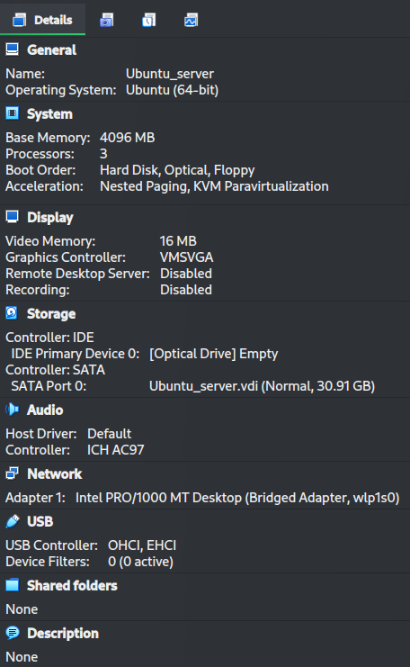
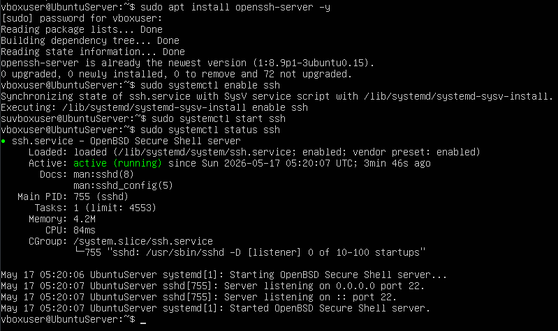
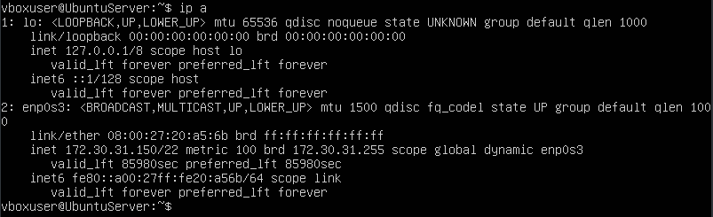
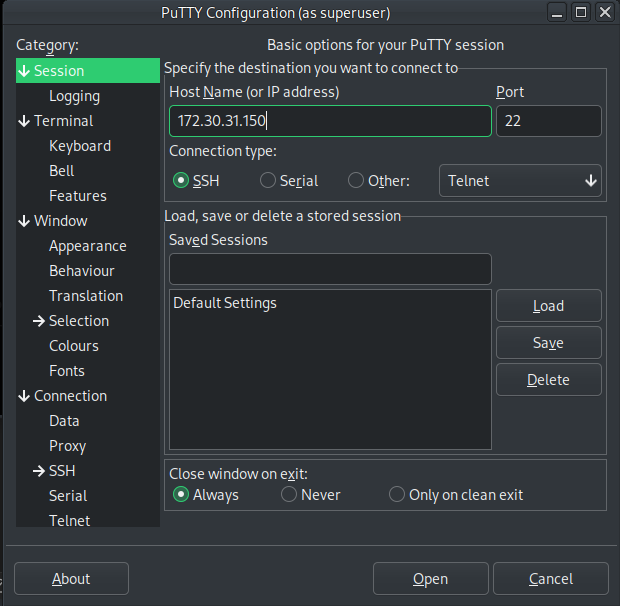
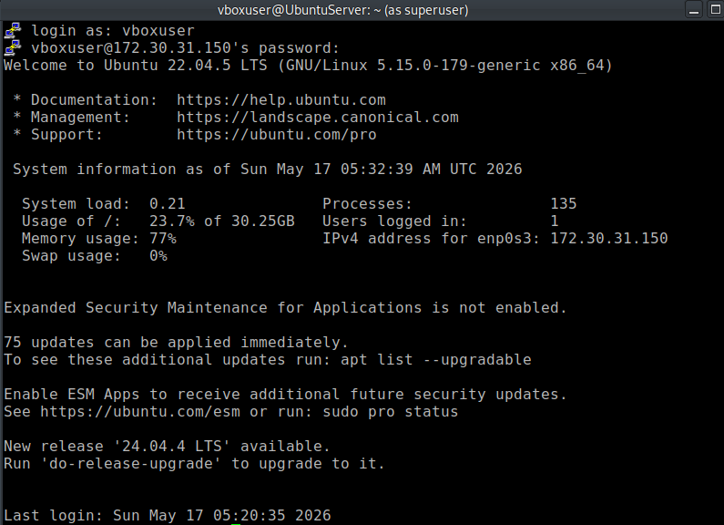

# Title: Step-by-Step SIEM/SOC Lab Setup (Wazuh + PuTTY Integration)

## Overview
This document explains the step-by-step process of setting up a SIEM/SOC lab environment using VirtualBox, Ubuntu Server, PuTTY (SSH client), and Wazuh. The goal is to build a basic security monitoring environment and demonstrate remote administration via SSH.

---

## Step 1: Install PuTTY (SSH Client)

PuTTY is used to remotely access the Ubuntu Server VM via SSH.

### Installation (Parrot OS)
	sudo apt update
	sudo apt install putty -y

### Purpose
- Enables secure remote connection to the Ubuntu Server
- Used for command-line administration of the VM

---

## Step 2: Install and Configure Virtual Machine (Ubuntu Server)

A Virtual Machine is used to simulate a server environment for the SIEM setup.

### Tool Used
- VirtualBox

### Configuration
- Operating System: Ubuntu Server (LTS version)
- RAM: [4GB]
- Storage: [30GB]
- Network Mode: Bridged Adapter

### Purpose
- Provides isolated environment for SIEM deployment
- Simulates real-world server infrastructure

---

## Step 3: Enable SSH Access on Ubuntu Server

SSH is required for remote access via PuTTY.

	sudo apt update
	sudo apt install openssh-server -y
	sudo systemctl enable ssh
	sudo systemctl start ssh

### Verify SSH Status
	sudo systemctl status ssh

---

## Step 4: Find VM IP Address
	
	ip a

Example:
172.30.31.150

This IP is used for PuTTY connection.

---

## Step 5: Connect via PuTTY

### Configuration
- Host Name: VM IP Address (example: 172.30.31.150)
- Port: 22
- Connection Type: SSH

### Login
- Username: Ubuntu user account
- Password: VM password

---

## Step 6: Install Wazuh (SIEM Platform)

Wazuh is the core SIEM tool used for log collection, analysis, and threat detection.

### Install Wazuh (All-in-One)

Run the following command in the Ubuntu Server:

	sudo apt update
	curl -sO https://packages.wazuh.com/4.7/wazuh-install.sh
	sudo bash wazuh-install.sh -a

### Purpose
- Installs Wazuh Manager, Indexer, and Dashboard
- Sets up complete SIEM environment in one system

---

## Step 7: Manage Wazuh Services

After installation, Wazuh services can be controlled using systemctl.

### Check Status

	sudo systemctl status wazuh-manager
	sudo systemctl status wazuh-indexer
	sudo systemctl status wazuh-dashboard

---

### Start Services

	sudo systemctl start wazuh-manager
	sudo systemctl start wazuh-indexer
	sudo systemctl start wazuh-dashboard

---

### Stop Services

	sudo systemctl stop wazuh-manager
	sudo systemctl stop wazuh-indexer
	sudo systemctl stop wazuh-dashboard

---

### Enable Services (Auto-start on boot)

	sudo systemctl enable wazuh-manager
	sudo systemctl enable wazuh-indexer
	sudo systemctl enable wazuh-dashboard

---

### Restart Services

	sudo systemctl restart wazuh-manager
	sudo systemctl restart wazuh-indexer
	sudo systemctl restart wazuh-dashboard

---

## Step 8: Access Wazuh Dashboard

After services are running, open a browser and go to:

	https://<VM-IP>

Example:
	https://172.30.31.150

### Login Information
- Username: admin  
- Password: (Generated during installation)

---

## Final Result

- Wazuh SIEM successfully installed and running  
- Logs can be collected and monitored  
- Remote access via PuTTY + SIEM dashboard ready  

This completes the full SIEM/SOC lab setup.
